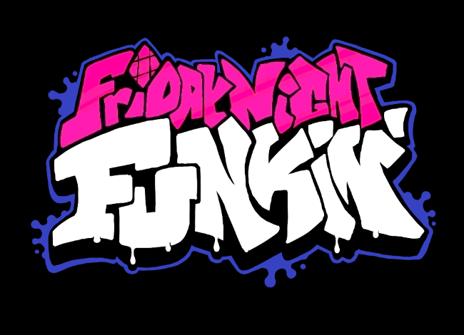
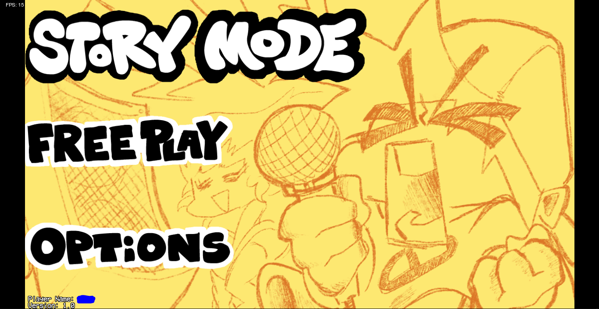
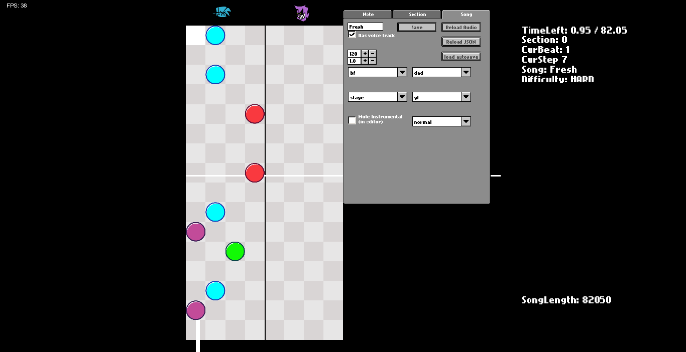
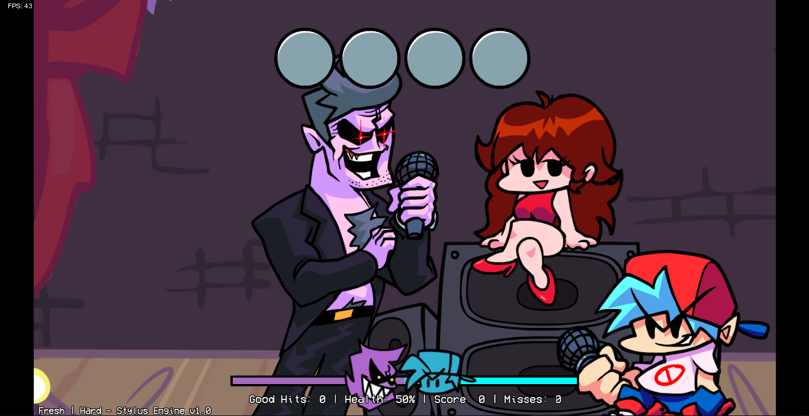

# Stylus Engine



# If you want to contribute in Stylus Engine, read [this](art/README.md).

# Discord
- **[Oficial AmsDev Discord](https://discord.gg/TGs8jBTBux)**
- **[FnF modding community](https://discord.gg/Aw4dzGRC)**

# Tags

`Stylus Engine`=`AmsDev`=`FridayNightFunkin'`=`Engine`=`NinjaMuffin`

# Desc

This is the Engine for Friday Night Funkin, game made by  [NinjaMuffin99](https://twitter.com/ninja_muffin99) 

Play the original game in:https://www.newgrounds.com/portal/view/770371

**IF YOU MAKE A MOD IN THIS ENGINE, OPEN THE SOURCE CODE IF YOUR MOD AS WELL**

# Credits
- [AmsDev](https://twitter.com/AmsDev2) - Programmer & Engine Creator
- [AndyGamer](https://twitter.com/AndyGamer1116YT) - Icon artist

# APIStuff

create APIStuff.hx
and put this

`````
package;

class APIStuff
{
	public static var API:String = "";
	public static var EncKey:String = "";
	public static var On:String = "";
	public static var Off:String = "";
}
`````
# Bugs

**If you have some problems contact me in mi oficial server
You can also ask the server moderators for help** [Here](#discord)

# Libs you need to install

- haxelib git polymod https://github.com/PabloelproxD210/Polymod
- haxelib git discord_rpc https://github.com/Aidan63/linc_discord-rpc
- haxelib git flixel-addons https://github.com/HaxeFlixel/flixel-addons
- haxelib git extension-webm https://github.com/KadeDev/extension-webm
- haxelib git hxvm-luajit https://github.com/nebulazorua/hxvm-luajit
- haxelib git linc_luajit https://github.com/nebulazorua/linc_luajit.git

Oh and thx(fuck u) MDC for passing me the libs :]


# Previews








## Enjoy!

Thx for download the engine have fun!!!!

# Friday Night Funkin

This is the repository for Friday Night Funkin, a game originally made for Ludum Dare 47 "Stuck In a Loop".

Play the Ludum Dare prototype here: https://ninja-muffin24.itch.io/friday-night-funkin
Play the Newgrounds one here: https://www.newgrounds.com/portal/view/770371
Support the project on the itch.io page: https://ninja-muffin24.itch.io/funkin

IF YOU MAKE A MOD AND DISTRIBUTE A MODIFIED / RECOMPILED VERSION, YOU MUST OPEN SOURCE YOUR MOD AS WELL

## Credits / shoutouts

- [ninjamuffin99 (me!)](https://twitter.com/ninja_muffin99) - Programmer
- [PhantomArcade3K](https://twitter.com/phantomarcade3k) and [Evilsk8r](https://twitter.com/evilsk8r) - Art
- [Kawaisprite](https://twitter.com/kawaisprite) - Musician

This game was made with love to Newgrounds and its community. Extra love to Tom Fulp.

### Installing the Required Programs

First, you need to install Haxe and HaxeFlixel. I'm too lazy to write and keep updated with that setup (which is pretty simple). 
1. [Install Haxe 4.1.5](https://haxe.org/download/version/4.1.5/) (Download 4.1.5 instead of 4.2.0 because 4.2.0 is broken and is not working with gits properly...)
2. [Install HaxeFlixel](https://haxeflixel.com/documentation/install-haxeflixel/) after downloading Haxe

Other installations you'd need are the additional libraries, a fully updated list will be in `Project.xml` in the project root. Currently, these are all of the things you need to install:
```
flixel
flixel-addons
flixel-ui
hscript
newgrounds
```
So for each of those type `haxelib install [library]` so shit like `haxelib install newgrounds`

### Ignored files

There is no ignored files, all are already fixxed xd

### Compiling game
NOTE: If you see any messages relating to deprecated packages, ignore them. They're just warnings that don't affect compiling

Once you have all those installed, it's pretty easy to compile the game. You just need to run `lime test html5 -debug` in the root of the project to build and run the HTML5 version. (command prompt navigation guide can be found here: [https://ninjamuffin99.newgrounds.com/news/post/1090480](https://ninjamuffin99.newgrounds.com/news/post/1090480))
To run it from your desktop (Windows, Mac, Linux) it can be a bit more involved. For Linux, you only need to open a terminal in the project directory and run `lime test linux -debug` and then run the executable file in export/release/linux/bin. For Windows, you need to install Visual Studio Community 2019. While installing VSC, don't click on any of the options to install workloads. Instead, go to the individual components tab and choose the following:
* MSVC v142 - VS 2019 C++ x64/x86 build tools
* Windows SDK (10.0.17763.0)

Once that is done you can open up a command line in the project's directory and run `lime test windows -debug`. Once that command finishes (it takes forever even on a higher end PC), you can run FNF from the .exe file under export\release\windows\bin
As for Mac, 'lime test mac -debug' should work, if not the internet surely has a guide on how to compile Haxe stuff for Mac.

### Additional guides

- [Command line basics](https://ninjamuffin99.newgrounds.com/news/post/1090480)
